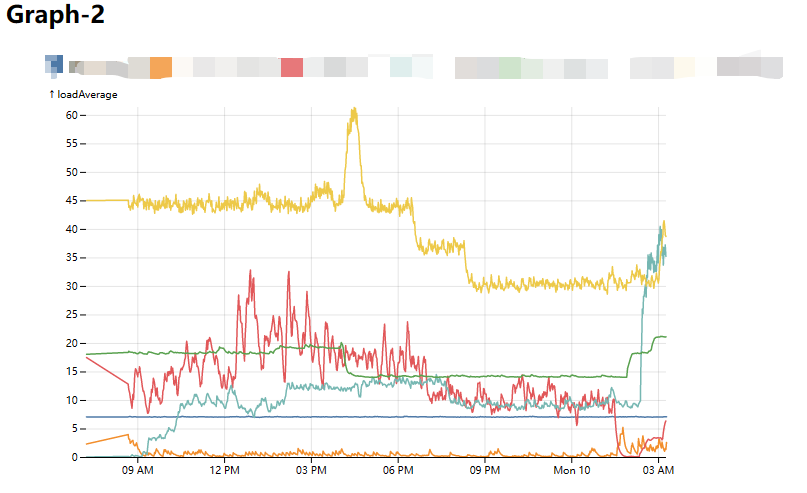

# Server monitor

I am building a server monitor combining shell, mongodb and web.
Wish me a good luck.

## Background loop

In the background, the server runs uptime-like check every 60 seconds.
The [monitor](./monitorloop/monitor.py) runs the job.
It also provides a simple console interface.

## Mongodb backend

The server status are stored in to the mongodb database.

## Flask app

The flask application is used to handle a web application.
The web application checks out the status as request.

